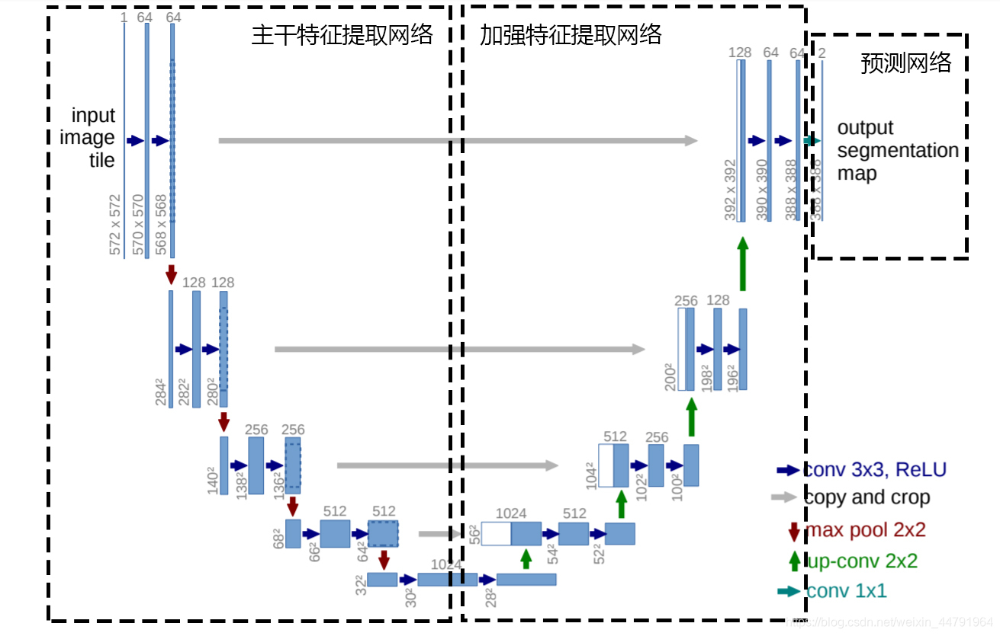
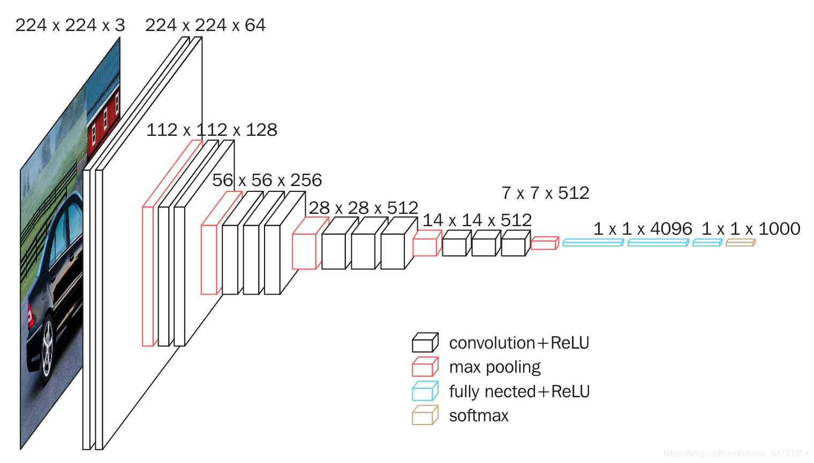

# U-Net for Image Segmentation

## U-Net 简介

U-Net 是一个语义分割模型，它使用了卷积神经网络来提取图像特征，并使用上采样和下采样的操作来进行特征的重建。U-Net 的结构如下图所示：



- 第一部分是**主干特征提取部分**，我们可以**利用主干部分**获得一个又一个的**特征层**。**利用主干特征提取部分我们可以获得五个初步有效特征层**，在第二步中，我们会利用这五个有效特征层可以进行特征融合。
- 第二部分是**加强特征提取部分**，我们可以利用主干部分获取到的**五个初步有效特征层**进行上采样，并且进行特征融合，获得一个最终的，融合了**所有特征的有效特征层**。
- 第三部分是**预测部分**，我们会利用**最终获得的最后一个有效特征层**对每一个特征点进行分类，相当于对每一个像素点进行分类。

## U-Net 特点

- **精确的定位能力**：由于跳跃连接的使用，U-Net 能够结合编码路径中的高分辨率特征和解码路径中的上下文信息，从而实现精确的图像分割。
- **适用于小样本学习**：U-Net 可以很好地处理小样本学习问题，因为它能够从有限的数据中学习到有用的特征表示。
- **端到端学习**：U-Net 是一个端到端的模型，可以直接从原始图像学习到分割图，无需任何中间步骤。
- **灵活性**：U-Net 可以很容易地适应不同的图像分割任务，只需调整输入和输出层即可。
- **适用于医学图像分割**：U-Net 在医学图像分割领域尤其受欢迎，因为它能够处理医学图像中的噪声和不均匀性。

## U-Net 实现

- **`[3,3]`卷积操作**：指的是使用一个大小为`3x3`的卷积核（或滤波器）对输入图像或特征图进行卷积处理的过程。这里的数字3表示卷积核在水平和垂直方向上的尺寸都是3个像素点。
- **`2x2`最大池化：**最大池化通常使用`2x2`的池化核，步长为2，这意味着池化核覆盖`2x2`像素的区域，然后输出该区域的最大值。这样，输出特征图的尺寸是输入特征图尺寸的一半。最大池化也可以使用不同的池化核尺寸和步长，但`2x2`池化核是最常用的。
- **下采样操作：**

### 主干提取部分的实现

U-Net 的主干特征提取部分由卷积 + 最大池化组成。当输入的图像大小为 `512x512x3` 的时候，具体执行方式如下：

1. `conv1`：进行两次`[3,3]`的**64**通道的卷积，获得一个`[512,512,64]`的初步有效特征层，再进行`2x2`最大池化，获得一个`[256,256,64]`的特征层。
2. `conv2`：进行两次`[3,3]`的**128**通道的卷积，获得一个`[256,256,128]`的初步有效特征层，再进行`2x2`最大池化，获得一个`[128,128,128]`的特征层。
3. `conv3`：进行三次`[3,3]`的**256**通道的卷积，获得一个`[128,128,256]`的初步有效特征层，再进行`2x2`最大池化，获得一个`[64,64,256]`的特征层。
4. `conv4`：进行三次`[3,3]`的**512**通道的卷积，获得一个`[64,64,512]`的初步有效特征层，再进行`2x2`最大池化，获得一个`[32,32,512]`的特征层。
5. `conv5`：进行三次`[3,3]`的**512**通道的卷积，获得一个`[32,32,512]`的初步有效特征层。



```python
def encoder(img_input, activation='relu'):
    """
    Encode part of the U-Net model.
    
    Parameters
    ----------
    img_input : keras.layers.Input
        Input layer of the model.
    activation : str
        Activation function used in the model.
    
    Returns
    -------
    feat1, feat2, feat3, feat4, feat5 : keras.layers.Layer
        Output layers of the model.
    """
    # Block 1
    # Input size: 512x512x3
    # Output size: 512x512x64
    x = layers.Conv2D(
        64, (3, 3), activation=activation, padding='same', name='block1_conv1'
    )(img_input)
    x = layers.Conv2D(
        64, (3, 3), activation=activation, padding='same', name='block1_conv2'
    )(x)
    feat1 = x
    # MaxPooling
    # Input size: 512x512x64
    # Output size: 256x256x64
    x = layers.MaxPooling2D((2, 2), strides=(2, 2), name='block1_pool')(x)

    # Block 2
    # Input size: 256x256x64
    # Output size: 256x256x128
    x = layers.Conv2D(
        128, (3, 3), activation=activation, padding='same', name='block2_conv1'
    )(x)
    x = layers.Conv2D(
        128, (3, 3), activation=activation, padding='same', name='block2_conv2'
    )(x)
    feat2 = x
    # MaxPooling
    # Input size: 256x256x128
    # Output size: 128x128x128
    x = layers.MaxPooling2D((2, 2), strides=(2, 2), name='block2_pool')(x)

    # Block 3
    # Input size: 128x128x128
    # Output size: 128x128x256
    x = layers.Conv2D(
        256, (3, 3), activation=activation, padding='same', name='block3_conv1'
    )(x)
    x = layers.Conv2D(
        256, (3, 3), activation=activation, padding='same', name='block3_conv2'
    )(x)
    x = layers.Conv2D(
        256, (3, 3), activation=activation, padding='same', name='block3_conv3'
    )(x)
    feat3 = x
    # MaxPooling
    # Input size: 128x128x256
    # Output size: 64x64x256
    x = layers.MaxPooling2D((2, 2), strides=(2, 2), name='block3_pool')(x)

    # Block 4
    # Input size: 64x64x256
    # Output size: 64x64x512
    x = layers.Conv2D(
        512, (3, 3), activation=activation, padding='same', name='block4_conv1'
    )(x)
    x = layers.Conv2D(
        512, (3, 3), activation=activation, padding='same', name='block4_conv2'
    )(x)
    x = layers.Conv2D(
        512, (3, 3), activation=activation, padding='same', name='block4_conv3'
    )(x)
    feat4 = x
    # MaxPooling
    # Input size: 64x64x512
    # Output size: 32x32x512
    x = layers.MaxPooling2D((2, 2), strides=(2, 2), name='block4_pool')(x)

    # Block 5
    # Input size: 32x32x512
    # Output size: 32x32x512
    x = layers.Conv2D(
        512, (3, 3), activation=activation, padding='same', name='block5_conv1'
    )(x)
    x = layers.Conv2D(
        512, (3, 3), activation=activation, padding='same', name='block5_conv2'
    )(x)
    x = layers.Conv2D(
        512, (3, 3), activation=activation, padding='same', name='block5_conv3'
    )(x)
    feat5 = x

    return feat1, feat2, feat3, feat4, feat
```

### 加强特征提取部分的实现

Unet所使用的**加强特征提取网络是一个U的形状。**

利用第一步我们可以获得**五个初步的有效特征层**，在加强特征提取网络这里，我们会利用这五个**初步的有效特征层进行特征融合**，**特征融合的方式**就是**对特征层进行上采样并且进行堆叠**

为了方便网络的构建与更好的通用性，我们的 U-Net 和上图的 U-Net 结构有些许不同，在**上采样时直接进行两倍上采样再进行特征融合**，最终获得的特征层和输入图片的高宽相同。

```python
def decoder(input_shape=(256, 256, 3), num_classes=21, activation='relu'):
    """
    Decode part of the U-Net model.
    
    Parameters
    ----------
    input_shape : tuple
        Shape of the input image.
    num_classes : int    
        Number of classes in the dataset.
    activation : str
        Activation function used in the model.
    
    Returns
    -------
    output : keras.layers.Layer
        Output layer of the model.
    """
    inputs = layers.Input(shape=input_shape)
    
    # Encoder part, Feautre maps
    feat1, feat2, feat3, feat4, feat5 = encoder(inputs)
    
    # Up-sampling
    # Input size: 32x32x512
    # Output size: 64x64x512
    P5_up = layers.UpSampling2D(size=(2, 2))(feat5)
    # Concatenate
    # Input size: 64x64x512
    # Output size: 64x64x1024
    P4 = layers.Concatenate(axis=3)([feat4, P5_up])
    # Convolutional layer
    # Input size: 64x64x1024
    # Output size: 64x64x512
    P4 = layers.Conv2D(
        512, 3, activation=activation, padding='same', kernel_initializer='he_normal'
    )(P4)
    P4 = layers.Conv2D(
        512, 3, activation=activation, padding='same', kernel_initializer='he_normal'
    )(P4)

    # Up-sampling
    # Input size: 64x64x512
    # Output size: 128x128x512
    P4_up = layers.UpSampling2D(size=(2, 2))(P4)
    # Concatenate
    # Input size: 128x128x512
    # Output size: 128x128x728
    P3 = layers.Concatenate(axis=3)([feat3, P4_up])
    # Convolutional layer
    # Input size: 128x128x728
    # Output size: 128x128x256
    P3 = layers.Conv2D(
        256, 3, activation=activation, padding='same', kernel_initializer='he_normal'
    )(P3)
    P3 = layers.Conv2D(
        256, 3, activation=activation, padding='same', kernel_initializer='he_normal'
    )(P3)
    
    # Up-sampling
    # Input size: 128x128x256
    # Output size: 256x256x256
    P3_up = layers.UpSampling2D(size=(2, 2))(P3)
    # Concatenate
    # Input size: 256x256x256
    # Output size: 256x256x384
    P2 = layers.Concatenate(axis=3)([feat2, P3_up])
    # Convolutional layer
    # Input size: 256x256x384
    # Output size: 256x256x128
    P2 = layers.Conv2D(
        128, 3, activation=activation, padding='same', kernel_initializer='he_normal'
    )(P2)
    P2 = layers.Conv2D(
        128, 3, activation=activation, padding='same', kernel_initializer='he_normal'
    )(P2)
    
    # Up-sampling
    # Input size: 256x256x128
    # Output size: 512x512x128
    P2_up = layers.UpSampling2D(size=(2, 2))(P2)
    # Concatenate
    # Input size: 512x512x128
    # Output size: 512x512x192
    P1 = layers.Concatenate(axis=3)([feat1, P2_up])
    # Convolutional layer
    # Input size: 512x512x192
    # Output size: 512x512x64
    P1 = layers.Conv2D(
        64, 3, activation=activation, padding='same', kernel_initializer='he_normal'
    )(P1)
    P1 = layers.Conv2D(
        64, 3, activation=activation, padding='same', kernel_initializer='he_normal'
    )(P1)
    
    # Output layer
    # Input size: 512x512x64
    # Output size: 512x512xnum_classes
    P1 = layers.Conv2D(
        num_classes, 1, activation='softmax', name='final_conv'
    )(P1)
    
    model = models.Model(inputs=inputs, outputs=P1)
    
    return model
```

### 实战案例

1. 导入必要的库
2. 定义输入层和输出层
3. 定义模型结构
4. 编译模型
5. 训练模型
6. 评估模型
7. 预测结果

